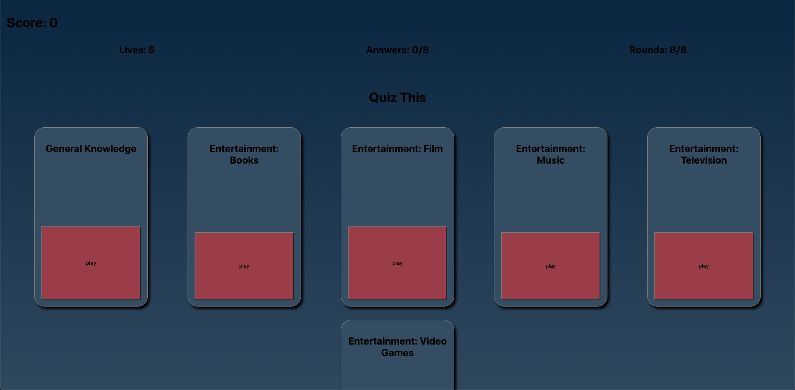
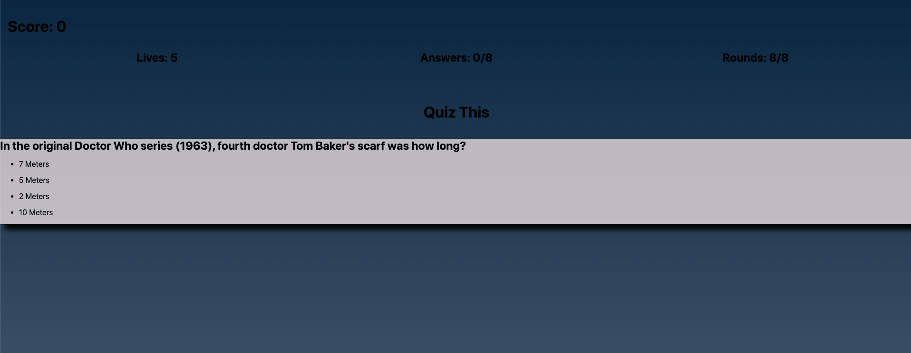
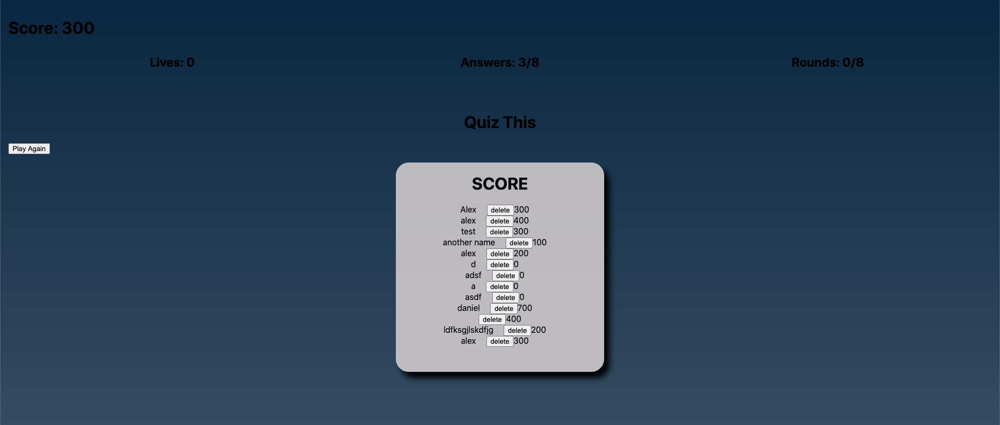

# Quiz This

A trivia game, with multiple questions across various categories

[live Demo](https://quizthis.netlify.app/)



## Getting started

Clone this repo, and cd into the directory

Running the Frontend:

*  `npm install`
*  `npm start`

[Backend](https://github.com/ALmsq/Quiz-this-api) is running Ruby on Rails with PostgresSQL on a Heroku server. It may take some time to load initially.

The questions were seeded on the backend and fetched with the HTTParty gem

```javascript
difficulties = ['easy', 'medium', 'hard']
categories = (1..15).to_a

categories.each{|category_number|

    difficulties.each{|level|
    trivia_url = "https://opentdb.com/api.php?amount=20&category=#{category_number}&difficulty=#{level}&type=multiple"
    trivia_data = HTTParty.get(trivia_url)

        trivia_data['results'].each{|category_question|
            sanitizeQuest = CGI.unescapeHTML(category_question['question'])
            sanitizeAns = CGI.unescapeHTML(category_question['correct_answer'])
            cat = Category.find_or_create_by(name: category_question['category'])
            quest = Question.new(question: sanitizeQuest, r_ans: sanitizeAns, category: cat)
            quest.w_ans1 = CGI.unescapeHTML(category_question['incorrect_answers'][0])
            quest.w_ans2 = CGI.unescapeHTML(category_question['incorrect_answers'][1])
            quest.w_ans3 = CGI.unescapeHTML(category_question['incorrect_answers'][2])
            quest.save
        }
    }
}
```

## Features

**Open Trivia DB**

Randomly generated questions provided by the [Open Trivia DB API](https://opentdb.com/) through 6 different categories.



The trivia game gives a chance of 8/8 questions with 5 failed attempts before the game is over



After completing the trivia, there's a chance to add your name to the list of scores

## Technologies Used

**Frontend**

* Javascript

**Backend**

* Ruby on Rails
* PostgresSQL
* Open Trivia API


